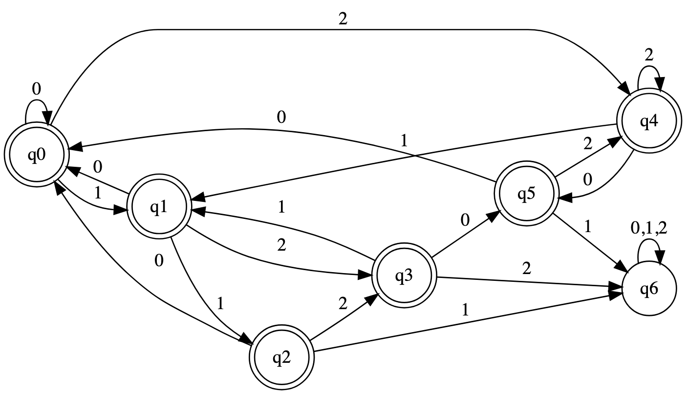

# Evidence 1 Implementation of Lexical Analysis - A07184003

## Description

The language I chose consists of all possible combinations of **0, 1, 2**, **but not** `111`, `122`, or `201`.

The **modeling technique** I decided to use was a **Deterministic Finite Automaton (DFA)** to represent my solutions because even if theyre somewhat harder to implement than a NFA, I think its gonna be much easier implementing it in prolog.

---

## Model of the Solution

I made a single automaton for this language. Even tho its very big and might seem like a mess, it isnt, I would like to explain the simplest sequences of the automaton which is what i made first.

> **Ensuring "111" does not appear:**
> - Transition path: `q0 → q1 → q2 → q6`

> **Ensuring "122" does not appear:**
> - Transition path: `q0 → q1 → q3 → q6`

> **Ensuring "201" does not appear:**
> - Transition path: `q0 → q4 → q5 → q6`

obviusly theres a few tweaks i made so that each possibility is covered in the DFA, but i started with those 3 sequences to make it simple (Benjamin's suggestion in class).

```
DFA Diagram:
(Refer to the image below)
```



### Transition Table

| **State** | **0**  | **1**  | **2**  | **Valid?** |
|-----------|--------|--------|--------|------------|
| **q0**    | q0     | q1     | q4     | Yes        |
| **q1**    | q0     | q2     | q3     | Yes        |
| **q2**    | q0     | q6     | q3     | Yes        |
| **q3**    | q5     | q1     | q6     | Yes        |
| **q4**    | q5     | q1     | q4     | Yes        |
| **q5**    | q0     | q6     | q4     | Yes        |
| **q6**    | q6     | q6     | q6     | No         |

### Equivalent Regular Expressions

The presented sequences in the automaton are equivalent to the following **regular expressions**:

Sequence 1 -> RE 1:
```
^(?!.*111)
```

Sequence 2 -> RE 2:
```
^(?!.*122)
```

Sequence 3 -> RE 3:
```
^(?!.*201)
```


### Full DFA Expression:
The DFA would be equivalent to the following **regular expression**:
```
^(?!.*111)(?!.*122)(?!.*201)[012]+$
```

---

## Implementation

For my implementation of a lexical analysis, I used Prolog to directly model the DFA instead of python or something like that. Following the declarative programming paradigm outlined by Sterling and Shapiro (2018), I chose a declarative approach that separates the structure of the automaton from the processing logic.

- The implementation is found in the `automaton.pl` file.
- To check if a string is valid in the language, use the query:
  
  ```prolog
  accepts("[ExampleString]").
  ```

- Some examples of inputs and outputs:
  
  ```prolog
  accepts("1122").  % true
  accepts("111").   % false
  accepts("122").   % false
  accepts("201").   % false
  accepts("0120").  % true
  ```

---

## Tests

The file `tests.pl` ccontains all the cases i could think of (and had the energy to write) tested for my automaton. 

The list of tests contains both positive cases (strings that should be accepted) and negative cases (strings that should be rejected), so that the correct implementation of the automaton is clear.

---

## Complexity Analysis

The complexity of my solution is **O(n) time complexity**, where **n** is the length of the string to be processed. This linear time complexity is achieved because:

- **State Transitions:** For each character in the input string, the DFA makes exactly one state transition. Each transition operation has a constant time complexity O(1) since it's a simple lookup in the transition table (Cormen et al., 2022).
- **Sequential Processing:** The DFA processes each input symbol exactly once, in sequential order, without any backtracking. This gives us n transition operations for a string of length n.
- **Final State Check:** After processing all input symbols, a single constant-time operation O(1) is performed to check if the final state is an accepting state.

### Algorithm Representation:
The resulting algorithm can be represented as:

```python
function accepts(string):
    current_state = q0
    for each character c in string:
        current_state = transition(current_state, c)
    return is_accepting(current_state)
```

> Overall Complexity: O(n × 1) + O(1) = O(n)

---

## References

- **Benjamín Valdez (2025).** TC2037 - Implementation of Computational Methods.
- **Cormen, T.H., Leiserson, C.E., Rivest, R.L., & Stein, C. (2022).** Introduction to Algorithms (4th ed.). MIT Press.
- **Sterling, L., & Shapiro, E. (2018).** The Art of Prolog (2nd ed.). MIT Press.

---